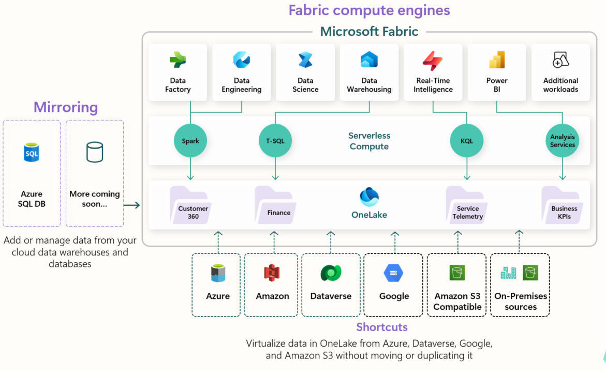
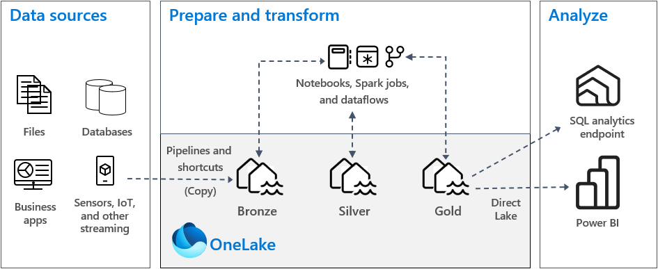

# Fundamentals

Microsoft Fabric is a unified analytics platform that brings together data engineering, data science, data warehousing, real-time intelligence, and business intelligence under a single product, a single capacity model, and a single storage layer. If you have worked with Power BI, you have already been working within Fabric — Power BI is one of its core workloads.

---

## What is Microsoft Fabric?

Fabric was announced at Microsoft Build in May 2023 and reached general availability in November 2023. It is Microsoft's answer to the fragmentation problem in modern data platforms — organizations typically ran separate tools for ingestion, transformation, storage, analytics, and reporting, each with its own billing, governance, and access model.

  

Fabric consolidates all of these into one platform:

| Workload | Compute engine | What it does |
|----------|---------------|-------------|
| **Data Factory** | — | Data ingestion and orchestration — pipelines, dataflows, 200+ connectors |
| **Data Engineering** | Spark | Lakehouse development — notebooks, Spark jobs, large-scale transformation |
| **Data Science** | Spark | ML model development, experiment tracking, and operationalization |
| **Data Warehousing** | T-SQL | Full SQL analytics warehouse storing data natively in Delta Lake format |
| **Real-Time Intelligence** | KQL | Event streaming, KQL databases, and real-time dashboards |
| **Power BI** | Analysis Services | Semantic models, reports, and dashboards — the BI layer |
| **Databases** | T-SQL | Transactional SQL databases and mirroring from external sources into OneLake |
| **Fabric IQ** | — | Unified business semantics — ontologies, metrics, and context-aware AI agents *(preview)* |
| **Additional workloads** | — | Third-party and custom workloads via the Fabric Extensibility Toolkit |

All workloads share the same underlying storage (OneLake), the same capacity (F SKUs), and the same governance model (Microsoft Purview).

---

## OneLake

OneLake is the single storage layer for all Fabric data. Think of it as OneDrive for your organization's data — one lake, one namespace, accessible by every Fabric workload without copying or moving data.

Key properties:

- **One per tenant** — every organization has exactly one OneLake, even if it has multiple workspaces and capacities
- **Delta format** — all data is stored in Delta Lake format (Parquet + transaction log), making it open and interoperable
- **Unified namespace** — every item in Fabric (lakehouse, warehouse, KQL database) has a path in OneLake
- **Shortcuts** — virtual pointers to data in external sources (Azure, ADLS Gen2, Amazon S3, Google, Dataverse, on-premises) that appear as if the data lives in OneLake without copying or moving it
- **Mirroring** — continuous replication of external databases (Azure SQL, Cosmos DB, Snowflake, Databricks) into OneLake as Delta tables, kept in sync in near real-time

!!! note
    Because all workloads read from the same OneLake storage, there is no need to copy data between a data lake and a warehouse, or between a lakehouse and a Power BI semantic model. This is what makes Direct Lake mode possible — Power BI reads directly from the Delta files without importing them.

---

## Workspaces and Capacities

### Workspaces

Workspaces in Fabric serve the same role as in Power BI Service — they are containers for items (lakehouses, notebooks, pipelines, semantic models, reports). Every item belongs to exactly one workspace.

Workspaces have a **workspace type** that determines which capacity backs them:

| Workspace type | Backed by | Fabric workloads |
|---------------|-----------|-----------------|
| Pro / PPU | Shared Microsoft capacity | Power BI only |
| Fabric (Trial) | Trial F64 capacity | All Fabric workloads |
| Fabric (F SKU) | Dedicated F capacity | All Fabric workloads |
| Premium (P SKU) | Dedicated P capacity | All Fabric workloads (legacy) |

!!! tip
    Only workspaces backed by a Fabric or Premium capacity can use non-Power BI Fabric workloads (lakehouses, notebooks, pipelines, etc.). A Pro workspace is limited to Power BI items only.

### Capacities

A Fabric capacity (F SKU) is a pool of compute resources shared across all workloads in all workspaces assigned to it. Resources are measured in Capacity Units (CUs) and shared dynamically — a Spark job, a pipeline run, and a Power BI report query all draw from the same pool.

The F64 capacity is the key threshold:
- **Below F64** — Power BI report consumers still need a Pro license
- **F64 and above** — Power BI report consumers can view content with a free license

See [Licensing](../powerbi/licensing.md) for the full F SKU breakdown.

---

## The Fabric Architecture

A typical Fabric architecture follows the medallion pattern — data flows through three layers, each with increasing quality and structure:

  

| Layer | Also called | What it contains | How it gets there |
|-------|-------------|-----------------|-------------------|
| **Bronze** | Landing | Raw data as it arrives — no transformation, no cleaning | Pipelines, Dataflows, Shortcuts |
| **Silver** | Curated | Cleaned, conformed, deduplicated | Spark notebooks or pipelines transform Bronze → Silver |
| **Gold** | Serving | Business-ready aggregations, star schema tables | Spark or SQL transforms Silver → Gold, consumed by Power BI via Direct Lake |

Each layer is typically a separate lakehouse or a set of schemas within a warehouse.

---

## Fabric Items

Everything created in Fabric is an **item** — a named object that lives in a workspace and is stored in OneLake. Common item types:

| Item | Workload | Description |
|------|----------|-------------|
| **Lakehouse** | Analytics | Delta Lake storage with SQL analytics endpoint |
| **Notebook** | Analytics | Spark notebook for Python, Scala, SQL, R |
| **Spark Job Definition** | Analytics | Scheduled or triggered Spark jobs |
| **ML Model / Experiment** | Analytics | Machine learning model tracking and deployment |
| **Pipeline** | Data Factory | Orchestration of activities and data movement |
| **Dataflow Gen2** | Data Factory | Power Query-based transformation at scale |
| **Warehouse** | Databases | Full T-SQL analytics warehouse |
| **SQL Database** | Databases | Transactional SQL database (Azure SQL-compatible) |
| **Mirroring** | Databases | Continuous replication from external sources into OneLake |
| **KQL Database** | Real-Time Intelligence | Time-series and streaming data store |
| **Eventstream** | Real-Time Intelligence | Real-time event ingestion and routing |
| **Semantic Model** | Power BI | Data model connecting to Fabric or external sources |
| **Report** | Power BI | Interactive Power BI report |

---

## Git Integration

Fabric supports native Git integration at the workspace level — workspaces can be connected to a Git branch in Azure DevOps or GitHub. Changes made in the workspace are committed to the branch, and merges trigger deployment to other workspaces via deployment pipelines.

Items are stored in the repository using open formats:
- Semantic models and lakehouses → TMDL
- Reports → PBIR
- Notebooks → `.ipynb`
- Pipelines → JSON

This makes Fabric workloads proper software artifacts — reviewable in pull requests, deployable via CI/CD, and version-controlled like any other codebase.

→ See [Deployment & ALM](deployment.md) for Git integration, deployment pipelines, and CI/CD patterns.

---

## Best Practices

- Assign all production workspaces to a dedicated Fabric capacity — never use shared Pro capacity for production workloads
- Follow the medallion architecture — separate raw, curated, and serving layers into distinct lakehouses or schemas
- Use OneLake shortcuts to access external data (ADLS, S3) instead of copying data into Fabric
- Enable Git integration from the start — retrofitting version control is always harder than starting with it
- Use a single Fabric capacity per environment (dev, test, prod) — separate capacities give you billing isolation and deployment boundaries
- Monitor capacity usage with the **Fabric Capacity Metrics app** — throttling is silent and hard to diagnose without it