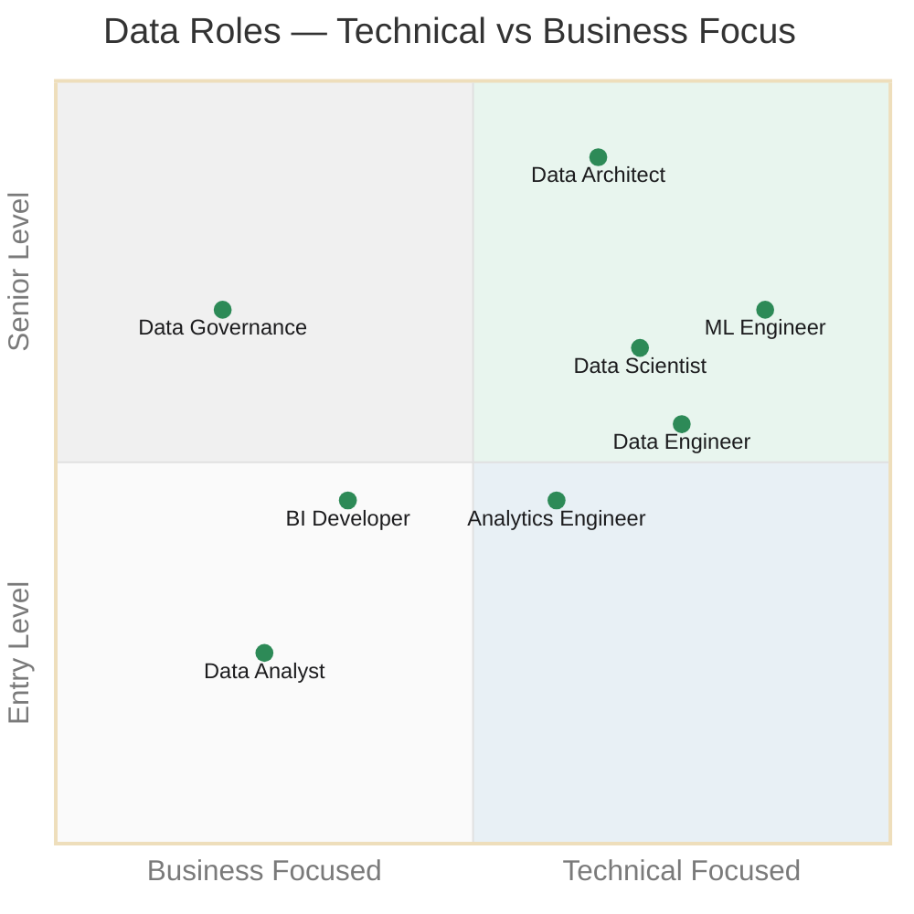
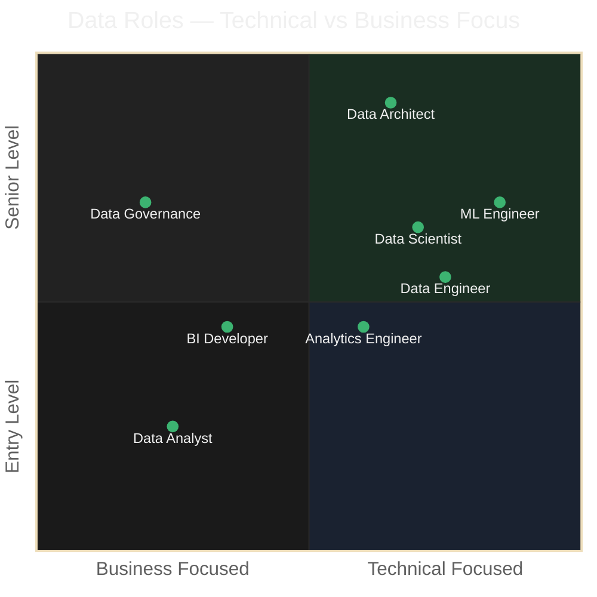

Understanding the main roles in data helps you decide where to start and where to grow. Each role is different in focus, tools, and required skills.

---

### 📊 Data Analyst

The Data Analyst is the bridge between raw data and business decisions. Their main job is to look at existing data, find patterns, and communicate findings clearly to non-technical stakeholders.

**What they do:**
- Build reports and dashboards in tools like Power BI, Tableau, or Looker
- Write SQL queries to extract and transform data
- Answer business questions with data — sales trends, customer behavior, performance metrics
- Present findings to managers and decision makers

**Tools:** SQL, Power BI, Excel, Tableau, Python (optional)

!!! Tip "To consider"
    **Best role to start in data.** The learning curve is manageable, the demand is high, and it gives you a solid foundation to grow into other roles.

---

### ⚙️ Data Engineer

The Data Engineer builds and maintains the infrastructure that makes data available for analysis. They focus on pipelines, storage, and data quality — making sure the right data gets to the right place reliably.

**What they do:**
- Design and build data pipelines (ETL/ELT)
- Manage databases, data warehouses, and data lakes
- Work with cloud platforms like Azure, AWS, or GCP
- Ensure data is clean, consistent, and available

**Tools:** Python, SQL, Spark, Airflow, dbt, Azure, Databricks

!!! Tip "To consider"
    **More technical and harder to start with.** Requires comfort with programming, cloud infrastructure, and systems thinking. Better as a second step after gaining experience as an analyst.

---

### 🤖 Data Scientist

The Data Scientist uses statistical modeling and machine learning to go beyond describing what happened — they predict what will happen and prescribe what to do about it.

**What they do:**
- Build predictive models and run experiments
- Apply statistics and machine learning algorithms
- Work closely with product and engineering teams
- Communicate probabilistic results to business stakeholders

**Tools:** Python, R, Jupyter, scikit-learn, TensorFlow, SQL

!!! Tip "To consider"
    **Competitive and not ideal as a first step.** Requires strong foundations in math, statistics, and programming. The role is also more saturated than analyst or engineer positions in many markets.

---

### ⚡ ML Engineer

The ML Engineer takes models built by data scientists and puts them into production. They focus on making machine learning systems reliable, scalable, and maintainable in real-world environments.

**What they do:**
- Deploy and monitor machine learning models in production
- Build infrastructure for model training and serving
- Optimize models for performance and scalability
- Work closely with data scientists and software engineers

**Tools:** Python, Docker, Kubernetes, MLflow, Airflow, cloud platforms

!!! Tip "To consider"
    **Highly technical and in high demand.** Requires strong software engineering skills on top of ML knowledge. Not a starting role, but one of the most valuable and well-paid in the data field right now — and less affected by AI than the data scientist role.

---

### 📈 BI Developer

The BI Developer focuses on building the reporting infrastructure that the business relies on daily. They sit between data engineering and analysis — designing data models, semantic layers, and dashboards that non-technical users can work with independently.

**What they do:**
- Design and maintain data models and semantic layers
- Build and publish reports and dashboards in Power BI, SSRS, or similar tools
- Write complex DAX and SQL to support reporting needs
- Work closely with business stakeholders to translate requirements into solutions

**Tools:** Power BI, SQL Server, DAX, SSAS, Report Builder, Excel

!!! Tip "To consider"
    **A natural evolution from Data Analyst.** If you already work with Power BI and SQL, this role is a very accessible next step. High demand in enterprise environments, especially in the Microsoft ecosystem.

---

### 🔍 Analytics Engineer

A relatively new role that bridges data engineering and analytics. The analytics engineer transforms raw data into clean, reliable, well-documented datasets that analysts can use directly — without needing to write complex pipelines.

**What they do:**
- Build and maintain data transformation layers using tools like dbt
- Document data models and define business logic in a central place
- Ensure data quality and consistency across the warehouse
- Make data accessible and trustworthy for analysts and BI teams

**Tools:** dbt, SQL, Snowflake, BigQuery, Redshift, Git

!!! Tip "To consider"
    **Growing in demand and great for SQL-strong analysts.** If you are comfortable with SQL and want to move toward engineering without going full infrastructure, this is an ideal path.

---

### ☁️ Data Architect

The Data Architect designs the overall strategy and structure of an organization's data systems. They define how data is collected, stored, integrated, and accessed across the entire organization.

**What they do:**
- Define data architecture standards and best practices
- Design data warehouses, data lakes, and lakehouse architectures
- Evaluate and select technologies for the data stack
- Ensure scalability, security, and governance across systems

**Tools:** Cloud platforms (Azure, AWS, GCP), Spark, Kafka, Snowflake, Databricks

!!! Tip "To consider"
    **Senior role requiring broad experience.** Not an entry point — typically reached after years as a data engineer or solution architect. High impact and well compensated.

---

### 🛡️ Data Steward

A role focused on data quality, lineage, compliance, and documentation. As organizations accumulate more data and face stricter regulations, this role has become increasingly important — especially in finance, healthcare, and public sectors.

**What they do:**
- Define and enforce data quality standards
- Maintain data catalogs and lineage documentation
- Ensure compliance with regulations like GDPR, HIPAA, or CCPA
- Work with data owners across the business to establish ownership and accountability

**Tools:** Purview, Collibra, Alation, SQL, Excel

!!! Tip "To consider"
    **Less technical but highly strategic.** Often underestimated, but critical in large organizations. Growing in visibility as data regulation increases globally.

---

### 🗺️ Role Map

Where each role sits across two dimensions — how technical the work is, and how senior the position typically is. Use this as a rough orientation, not a strict rule.

