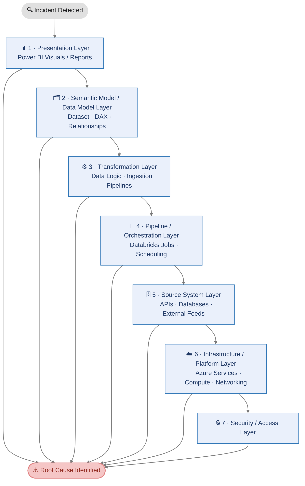
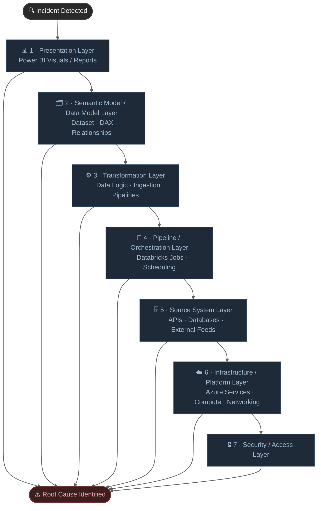

# Layered Data Platform Support Framework

Work from the **presentation layer inward** to the data source, then check infrastructure and security. Eliminate each layer before proceeding to the next.

## Environment & Assumptions

This framework is designed for a **Microsoft Azure-based data platform**. The BI layer is built on **Power BI**, used for report authoring, dataset management, and scheduled refresh.  

Data transformation and processing runs on **Azure Databricks**, leveraging PySpark notebooks and Workflows for job orchestration.  

Pipeline ingestion and movement is handled through **Azure Data Factory (ADF)**, with **Microsoft Fabric** progressively adopted as the unified analytics layer bridging pipelines, lakehouses, and semantic models.  

Underlying storage relies on **Azure Data Lake Storage (ADLS Gen2)** as the primary data store across bronze, silver, and gold zones. Identity, access control, and authentication are managed through **Azure Active Directory (Azure AD)**, including service principals, managed identities, and role-based access control across all platform components.

---

## 1 · Presentation Layer (Power BI Visuals / Reports)

*Start here — this is what the user sees. Eliminate visual and report-level issues before going deeper.*

- Check Power BI visuals for incorrect data, blank results, or rendering errors
- Validate report-level, page-level, and visual-level filters for unintended overrides
- Inspect slicer interactions and cross-filter behaviour between visuals
- Confirm correct fields and measures are bound to the right visuals
- Test row-level security behaviour across different user profiles
- Verify dataset refresh status — last successful run, failure message

---

## 2 · Semantic Model / Data Model Layer

*Covers the dataset as a whole — DAX logic, relationships, and filtering context.*

- Validate DAX measures and calculated columns for logic regressions or context errors
- Inspect table relationships — cardinality, cross-filter direction, ambiguous paths
- Check filtering logic — bidirectional filters, inactive relationships, USERELATIONSHIP
- Review Power Query transformations for errors or broken dependencies
- Verify data types and schema consistency (type mismatch = silent error)
- Check incremental refresh configuration and partition boundaries

---

## 3 · Transformation Layer (Data Logic / Ingestion Pipelines)

*Where data is shaped, cleaned, and prepared. Covers both SQL logic and Databricks transformations.*

- Review SQL transformation logic for recent changes or regressions
- Inspect Databricks notebooks and PySpark jobs — execution logs, stack traces
- Validate ingestion pipelines — source extraction, landing zone delivery, file formats
- Check joins and aggregations for fan-out, duplicates, or data loss
- Verify null handling, data cleaning rules, and edge case coverage
- Confirm business rule implementation matches current specification
- Check for schema drift or structural changes in upstream tables

---

## 4 · Pipeline / Orchestration Layer (Databricks Jobs / Scheduling)

*How and when transformations run. Covers job execution, dependencies, and triggers.*

- Check pipeline execution status in ADF / Databricks Workflows / Fabric
- Review job run logs — focus on the root error, not downstream cascade failures
- Inspect Databricks job DAG — identify the specific failing task
- Validate job dependencies — missing upstream output blocks all downstream steps
- Check scheduling and trigger configuration for missed or duplicated runs
- Verify upstream job completion and output availability before next stage
- Analyze abnormal job durations — data skew, resource contention, cold cluster start

---

## 5 · Source System Layer (APIs / Databases / External Feeds)

*The origin of all data. Covers availability, schema, volume, and quality at the source.*

- Verify source system availability — APIs, relational databases, file shares, SFTP
- Check external data feed delivery status and arrival timestamps
- Test API responses — status codes, payload structure, authentication
- Validate source schema changes — new columns, renamed fields, dropped tables
- Inspect record volume anomalies — sudden drop or spike vs. historical baseline
- Confirm source credentials, connection strings, and firewall / IP allowlist rules
- Check source data quality — duplicates, nulls, encoding issues, unexpected values

---

## 6 · Infrastructure / Platform Layer (Azure Services / Compute / Networking)

*The environment everything runs on. Check this layer to rule out platform-level failures.*

- Check Azure Service Health and Databricks status page for active incidents
- Verify Power BI gateway status and data source bindings
- Inspect Databricks cluster health — state, driver logs, autoscaling behaviour
- Validate Azure compute capacity — ADF integration runtime, Fabric capacity throttling
- Check networking — VNet peering, Private Link endpoints, DNS resolution
- Inspect authentication tokens and service account / managed identity expiry
- Verify Azure Data Lake Storage availability and tier configuration

---

## 7 · Security / Access Layer

*Cross-cutting layer — permission and credential issues can surface at any layer above.*

- Check Power BI workspace roles and per-report sharing settings
- Validate dataset access permissions and sensitivity label restrictions
- Verify service principal credentials, client secret expiry, and assigned roles
- Inspect ADLS container ACLs and storage account access policies
- Validate row-level security — role definitions, DAX filter expressions, user membership
- Confirm Azure AD group memberships and RBAC role assignments for affected users or SPNs
- Check Databricks workspace permissions — cluster policies, secret scope access, Unity Catalog grants