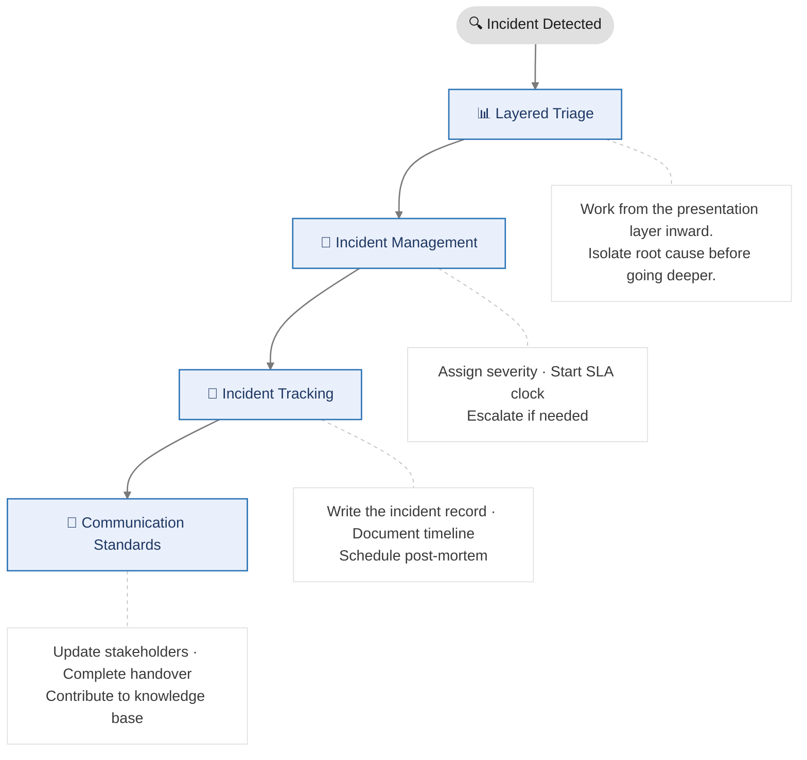
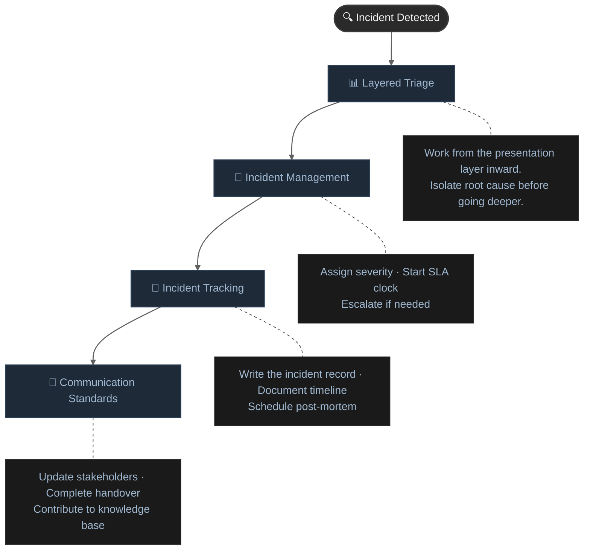

# Support Framework

A practical framework for supporting a production data platform built on Power BI, Azure Databricks, Azure Data Factory, and Microsoft Fabric.

The framework is organized around the four core responsibilities of a data platform support role: **investigating incidents**, **running daily operations**, **documenting and tracking work**, and **communicating clearly with stakeholders and teams**.

---

## Pages in This Section

| Page | Purpose |
|------|---------|
| [Layered Triage](layered-fw.md) | Work from the presentation layer inward — a structured method for isolating the root cause of any platform incident |
| [Incident Management](incident-management.md) | Severity classification, SLA tiers, response workflows, and escalation paths |
| [Daily Operations](daily-operations.md) | Shift start checklist, platform health checks, and handover template |
| [Incident Tracking](incident-tracking.md) | How to write an incident record, post-mortem structure, and knowledge base contribution |
| [Communication Standards](communication-standards.md) | How to communicate during outages, in handovers, and with stakeholders |

---

## How the Framework Fits Together
 

 

 

 
---

!!! tip "Start with Layered Triage"
    When an incident comes in, the [Layered Triage](layered-fw.md) page is your first reference. It tells you where to look and in what order — from the Power BI report surface all the way down to infrastructure and security.