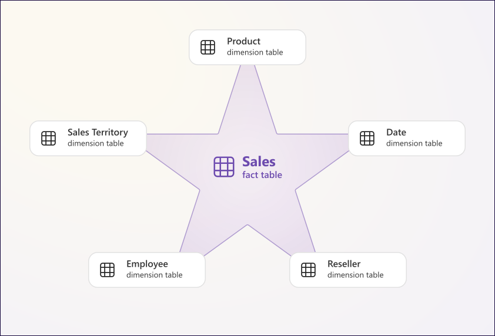

# Data Modeling

A well-designed data model is the foundation of every good Power BI report. It makes DAX simpler, reports faster, and maintenance easier. Everything built on top — measures, visuals, time intelligence — depends on the model being correct.

---

## The Star Schema

The star schema is the recommended modeling pattern for Power BI. It consists of two types of tables:

- **Fact tables** — contain measurable events (sales, orders, transactions). Large, with many rows. Each row is one event.
- **Dimension tables** — contain descriptive attributes (customers, products, dates). Smaller, with one row per entity.

<p align="center">
  
</p>

Dimensions sit around the fact table like points of a star. Filters flow from dimensions into the fact table — this is what makes slicing by date, product, or customer work naturally.

!!! tip
    Always aim for a star schema. Flat tables (everything in one wide table) and snowflake schemas (dimensions joined to other dimensions) both complicate DAX and hurt performance. A snowflake schema forces filters to travel through multiple hops before reaching the fact table — flatten dimension joins in Power Query before loading.

---

## Relationships

Relationships connect tables so filters can flow between them. Every relationship has two properties: cardinality and cross-filter direction.

### Cardinality

| Type | Description | When to use |
|------|-------------|-------------|
| **One-to-many (1:*)** | One row in the dimension matches many rows in the fact table | Standard — always the default target |
| **Many-to-many (*:*)** | Multiple rows on both sides can match | Use with caution — can cause ambiguous results and double-counting |
| **One-to-one (1:1)** | One row on each side | Rare — usually means the tables should be merged |

!!! warning
    Many-to-many relationships are sometimes unavoidable, but they require careful testing. DAX measures can produce unexpected totals when filters travel across a many-to-many join. Always validate results against a known source before publishing.

### Cross-filter direction

- **Single** — filters flow from the one side to the many side (dimension → fact). Default and strongly recommended.
- **Both** — filters flow in both directions. Use sparingly — it can cause circular dependencies, ambiguous filter paths, and slower query performance.

!!! tip
    If you feel the need to set a relationship to Both, first ask whether the model structure is right. In most cases, a schema adjustment or a DAX pattern using `CROSSFILTER()` is a better solution.

---

## Inactive Relationships and Role-Playing Dimensions

A fact table often contains multiple date columns — for example, `order_date`, `ship_date`, and `due_date`. A single date dimension table can only have one active relationship to the fact table at a time. The others must be defined as **inactive relationships**.

```
dim_date ──(active)──▶ order_date
dim_date ──(inactive)─▶ ship_date
dim_date ──(inactive)─▶ due_date
```

This pattern is called a **role-playing dimension** — the same dimension table plays different roles depending on which date column is being analyzed.

To use an inactive relationship in a measure, activate it explicitly with `USERELATIONSHIP()` inside `CALCULATE`. A measure is a DAX formula that aggregates data at query time — here, `[Total Sales]` is a measure that sums the sales amount, and `CALCULATE` modifies the filter context it evaluates in:

```dax
-- [Total Sales] uses the active relationship (order_date) by default
-- USERELATIONSHIP overrides it to use ship_date for this measure only
Sales by Ship Date =
CALCULATE(
    [Total Sales],
    USERELATIONSHIP(dim_date[date], fact_sales[ship_date])
)
```

!!! note
    `USERELATIONSHIP()` only works inside a `CALCULATE` context. It temporarily activates the specified inactive relationship for that measure evaluation only — the active relationship is unaffected everywhere else.

---

## The Date Table

Every Power BI model that uses time intelligence (YTD, MTD, previous year, rolling periods) requires a proper date table. The built-in auto date/time feature creates hidden date tables automatically, but they are inefficient and unsuitable for production models.

### Requirements

- Must contain one row per day with no gaps across the full date range of your data
- Must be marked as a date table in Power BI Desktop (**Table tools → Mark as date table**)
- Must have an active relationship to every fact table that contains a date column

### DAX vs Power Query — which to use

Both approaches produce a valid date table, but they behave differently:

- **DAX** (`CALENDAR`, `CALENDARAUTO`) — the table is created and lives inside the model. It recalculates dynamically at refresh, so `TODAY()` as an end date always extends the range automatically. This is the faster option to set up and the most common choice in practice.
- **Power Query** — the table is built during the ETL step before it reaches the model. More flexible for complex fiscal calendars, localization, or when the date table needs to be shared across multiple reports from the same data source. More work to set up, but gives full M language control over every column.

!!! tip
    For most reports, DAX is the right choice — less setup, dynamic range, and no extra Power Query query to maintain. Use Power Query when the date table needs to satisfy requirements that DAX cannot easily express, such as custom fiscal periods or multi-language month names.

### Creating the date table in DAX

```dax
dim_date =
VAR start_date = DATE(2020, 1, 1)
VAR end_date   = TODAY()
VAR calendar   = CALENDAR(start_date, end_date)
RETURN
ADDCOLUMNS(
    calendar,
    "Year",         YEAR([Date]),
    "Quarter",      "Q" & QUARTER([Date]),
    "Month Number", MONTH([Date]),
    "Month Name",   FORMAT([Date], "MMMM"),
    "Week Number",  WEEKNUM([Date]),
    "Day of Week",  FORMAT([Date], "DDDD"),
    "Is Weekday",   IF(WEEKDAY([Date], 2) <= 5, TRUE, FALSE)
)
```

Use `CALENDARAUTO()` instead of `CALENDAR()` to automatically detect the date range from all date columns in the model — useful when the date range changes frequently:

```dax
dim_date =
ADDCOLUMNS(
    CALENDARAUTO(),
    "Year",         YEAR([Date]),
    "Month Number", MONTH([Date]),
    "Month Name",   FORMAT([Date], "MMMM"),
    "Quarter",      "Q" & QUARTER([Date])
)
```

!!! tip
    Prefer `CALENDAR()` with explicit start and end dates in production — it gives you full control over the range. Use `CALENDARAUTO()` during development or when the date range is fully data-driven.

!!! warning
    Never use the auto date/time feature in production models. It creates one hidden date table per date column, bloats the model, and cannot be customized. Disable it globally in **File → Options → Data Load → Auto date/time**.

---

## Calculated Columns vs Measures

Both are DAX expressions, but they serve different purposes and behave differently at a fundamental level. Choosing the wrong one is one of the most common mistakes in Power BI development.

A **calculated column** is evaluated row by row at refresh time and stored as a physical column in the table — it has access to the current row but no awareness of what filters are applied in the report. A **measure** is evaluated at query time in response to the current filter context — every slicer, visual, and row in a matrix creates a different context, and the measure adapts to it automatically.

| | Calculated Column | Measure |
|--|-------------------|---------|
| Evaluated | At refresh time | At query time |
| Stored in model | ✅ Yes | ❌ No |
| Increases model size | ✅ Yes | ❌ No |
| Uses row context | ✅ Yes | ❌ No |
| Uses filter context | ❌ No | ✅ Yes |
| Best for | Segmentation, filtering, fixed labels | Aggregations, KPIs, time intelligence |

!!! tip
    Prefer measures over calculated columns for any aggregation or business logic. Measures are evaluated in the current filter context, making them flexible across any visual or slicer combination. Calculated columns are evaluated once at refresh and stored as static values — use them only for attributes needed in filters or row-level segmentation.

---

## Hiding vs Deleting Columns

Both remove a column from the report view, but they behave differently:

- **Hide** — the column remains in the model and can still be used in DAX, relationships, and Power Query. It simply does not appear in the field list for report builders.
- **Delete** — the column is removed from the model entirely. Any DAX measure or relationship that referenced it will break.

Always **hide** columns rather than delete them unless you are certain nothing depends on them. Foreign keys, surrogate keys, and technical columns should be hidden — not deleted — so relationships and DAX expressions continue to work.

---

## Best Practices

- Design the model before building visuals — a poorly structured model cannot be fixed with DAX
- Use consistent naming conventions — `dim_`, `fact_`, snake_case or PascalCase, applied everywhere
- Keep fact tables narrow — only foreign keys and numeric measures; all descriptive attributes belong in dimensions
- Hide foreign keys, surrogate keys, and technical columns from report view — never delete them
- Always create a date table manually and mark it as a date table
- Disable auto date/time in settings globally
- Set all relationships to single cross-filter direction by default — use `CROSSFILTER()` in DAX when bidirectional filtering is truly needed
- Avoid many-to-many relationships unless the business requirement explicitly demands it